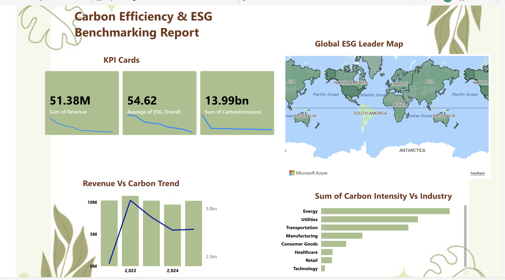

# Carbon Efficiency & ESG Benchmarking Report



## Overview

This project benchmarks **Environmental, Social & Governance (ESG)** performance across **1,000 companies** spanning 9 industries and 7 global regions over an 11-year period (2015–2025). Using SQL for feature engineering and Power BI for interactive visualization, it quantifies the relationship between sustainability scores, carbon efficiency, and financial performance.

## Key Findings

- **$51.38M** total revenue across the dataset with an average ESG score of **54.62**
- **13.99 billion** tonnes of cumulative carbon emissions tracked
- **Energy** and **Utilities** sectors lead in carbon intensity (emissions per dollar earned)
- **Technology** and **Retail** are the most carbon-efficient industries
- Only **17.5%** of companies qualify as **ESG Leaders** (score ≥ 70), while **19.4%** are classified as **High Risk**
- **63.1%** of companies fall in the **Average Performer** category — the biggest opportunity for improvement

## Project Structure

```
esg-sustainability-analysis/
├── README.md
├── .gitignore
├── raw_data/
│   └── company_esg_financial_dataset.csv     # Original dataset (11,000 rows, 16 columns)
├── clean_data/
│   └── Cleaned_Sustainability_ESG.csv        # Transformed dataset (11,000 rows, 10 columns)
├── sql/
│   └── esg_analysis.sql                      # SQL view & analysis queries
├── report/
│   └── Carbon_Efficiency_ESG_Benchmarking.pbix
├── assets/
│   └── dashboard_preview.png                 # Dashboard screenshot
└── docs/
    └── data_dictionary.md                    # Full column definitions
```

## Data Pipeline

### Raw Data → SQL → Clean Data → Power BI

**1. Raw Data** (`raw_data/company_esg_financial_dataset.csv`)

The source dataset contains 11,000 records across 1,000 companies with 16 columns covering financial metrics, ESG sub-scores, and environmental footprint data.

**2. SQL Transformation** (`sql/esg_analysis.sql`)

The SQL script performs three key operations:

- **Profit Calculation** — derives actual profit from revenue and profit margin
- **ESG Classification** — categorizes companies into sustainability tiers:
  - **ESG Leader**: score ≥ 70
  - **Average Performer**: score 40–69
  - **High Risk / Laggard**: score < 40
- **Carbon Intensity** — calculates emissions per dollar of revenue, enabling fair cross-industry comparison

**3. Clean Data** (`clean_data/Cleaned_Sustainability_ESG.csv`)

The output of the SQL view: a streamlined 10-column dataset ready for visualization.

**4. Power BI Report** (`report/Carbon_Efficiency_ESG_Benchmarking.pbix`)

Interactive dashboard featuring:

- KPI cards for revenue, ESG score, and total emissions
- Global ESG Leader map by region
- Revenue vs. Carbon emissions trend over time
- Carbon Intensity comparison across all 9 industries

## Dataset Coverage

| Dimension | Values |
|:---|:---|
| **Companies** | 1,000 unique companies |
| **Industries** | Technology, Finance, Healthcare, Energy, Manufacturing, Retail, Consumer Goods, Utilities, Transportation |
| **Regions** | North America, Europe, Asia, Latin America, Africa, Middle East, Oceania |
| **Time Span** | 2015 – 2025 (11 years) |
| **Records** | 11,000 rows |

## How to View the Report

**Power BI Service (Mac/Web):**
1. Go to [app.powerbi.com](https://app.powerbi.com)
2. Upload the `.pbix` file from the `report/` folder

**Power BI Desktop (Windows):**
1. Open the `.pbix` file directly in Power BI Desktop

## Tools & Technologies

- **MySQL** — data validation, feature engineering, and view creation
- **Power BI** — interactive dashboards and geospatial visualization
- **Git / GitHub** — version control

## Getting Started

```bash
# Clone the repository
git clone https://github.com/your-username/esg-sustainability-analysis.git
cd esg-sustainability-analysis

# (Optional) Set up Git LFS for large files
git lfs install
git lfs track "*.pbix"
```

## License

This project is for educational and portfolio purposes.

## Author

*Your Name*

[](https://github.com/your-username)
[](https://linkedin.com/in/your-profile)
